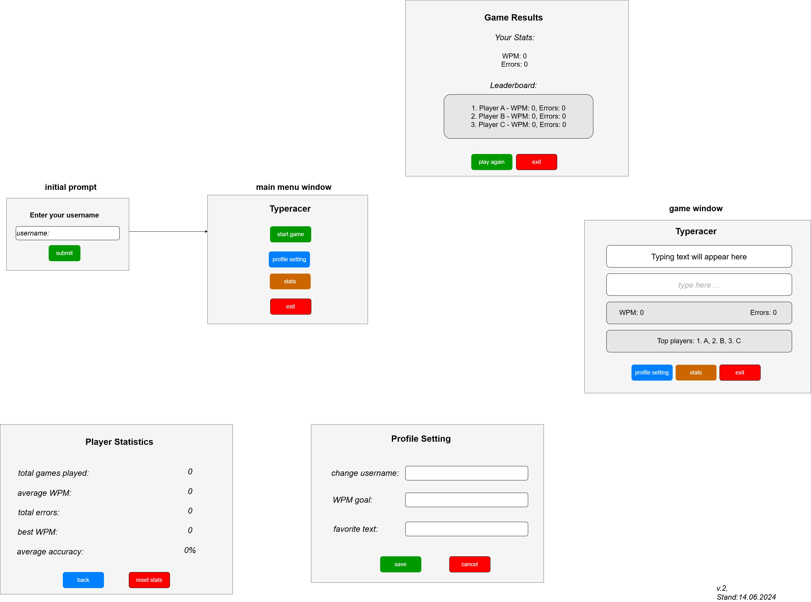

# GUI draft and Mockup

Das vorliegende GUI-Layout umfasst mehrere Fenster:
- Initial Prompt
- Main Menu
- Game Window
- Game Results
- Player Statistics
- Profile Setting

Diese werden für die Steuerung des Spiels und die Anzeige von Spielerstatistiken genutzt.
Ich schätze eure Vorschläge sehr.

[Figma prototype](https://www.figma.com/design/uCrSuOPMSvW5bZsPbyqQFJ/Untitled?m=dev&node-id=0-1&t=F6WFF0SbYhjorElq-1)
