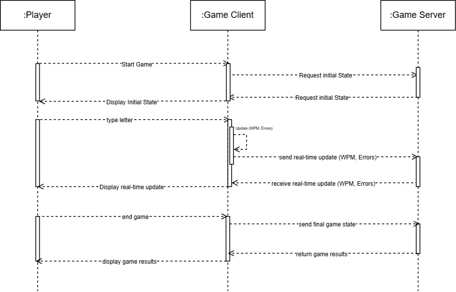

# Grobe Lösungsansätze für GUI aus JavaFX-Komponenten

## Aufbau der GUI aus JavaFX-Komponenten

| GUI-Aufbau             | Eingabefeld | Buttons                                  | Anmerkung                                                                                                                |
|------------------------|-------------|------------------------------------------|--------------------------------------------------------------------------------------------------------------------------|
| Initial Prompt         | ja          | submit                                   | Farbe der Buttons richtig auswählen                                                                                      |
| Main Menu              | nein        | start game, profile setting, stats, exit | Farbe der Buttons richtig auswählen                                                                                      |
| Game Window            | ja          | profile setting, stats, exit             | Braucht Textanzeige; zeigt WPM, Errors & Top players                                                                     |
| Result Window          | nein        | play again                               | `Table View` für Anzeige der Top players, WPM & Errors                                                                   |
| Player Stats Window    | nein        | exit, reset stats                        | `Table View` für Anzeige der Spielrunde, durchschnittliche WPM, Errors, beste WPM & durchschnittliche Genauigkeit (in %) |
| Profile Setting Window | ja (3)      | save, cancel                             | Farbe der Buttons richtig auswählen                                                                                      |

Layout von allem als `VBox` oder `GridPane`.

## Übertragung des Spielzustands

- Wie wird der Spielzustand übertragen?
  - Netzwerkprotokoll: Verwenden von JSON über HTTP oder WebSocket für die Kommunikation zwischen Client und Server.
  - Serialisierung: Spielzustandsdaten werden in JSON-Format serialisiert und über das Netzwerk gesendet.
  - Deserialisierung: Empfangene JSON-Daten werden deserialisiert und in Java-Objekte umgewandelt.

## Implementierung der GUI Mockups

1. Strukturplanung
   - Layout-Auswahl: Bestimmen, welche Layouts (z.B. `VBox`, `HBox`, `GridPane`) für welche GUI-Komponenten am besten geeignet sind.
   - Komponentenauswahl: Auswählen der benötigten JavaFX-Komponenten (z.B. `TextField`, `Button`, `Label`).
2. Komponentenplatzierung
   - Mockup-Umsetzung: Platzieren der Komponenten gemäß den Mockups in den gewählten Layouts.
   - Event-Handler: Implementieren von Event-Handlern für Benutzeraktionen (z.B. Knopf-Klicks).
3. Datenbindung und Validierung
   - Datenbindung: Verwenden von JavaFX-Properties und Bindings für die Echtzeit-Aktualisierung der GUI basierend auf dem Spielzustand.
   - Validierung: Implementieren von Eingabevalidierungen für die Benutzereingabe (z.B. Benutzernamen-Validierung).
4. Integration und Testen
   - Integration: Verbinden der GUI-Komponenten mit den Backend-Services für die Spielzustandsübertragung.
   - Testen: Durchführen von Funktionstests und Benutzerakzeptanztests, um sicherzustellen, dass die GUI wie erwartet funktioniert.
